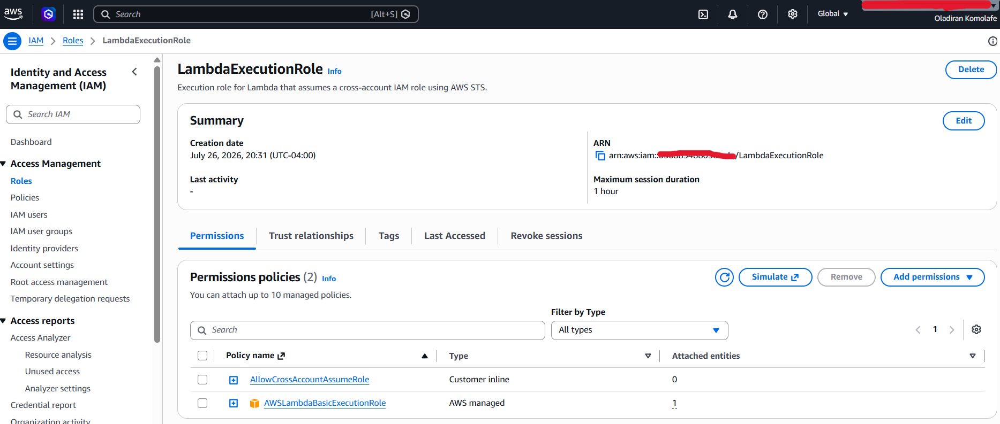
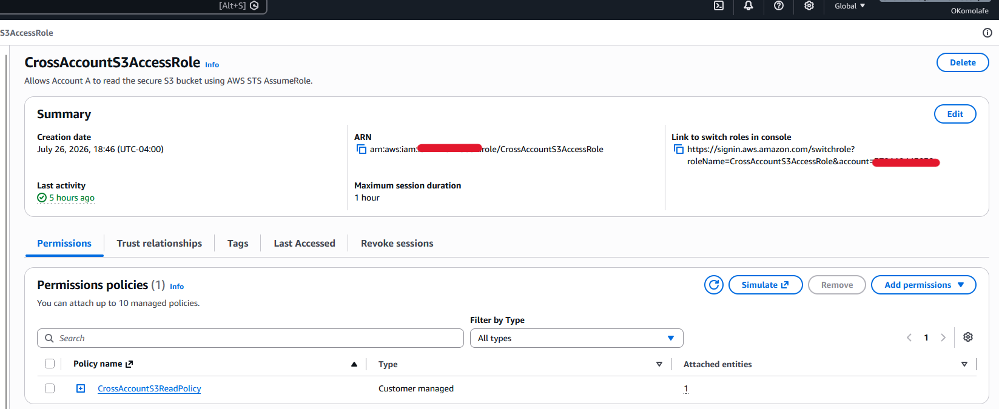
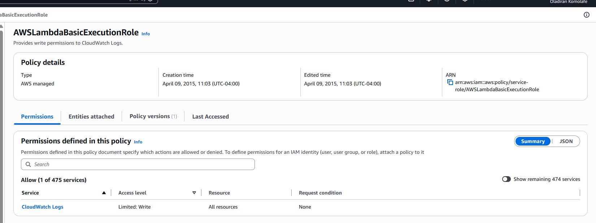
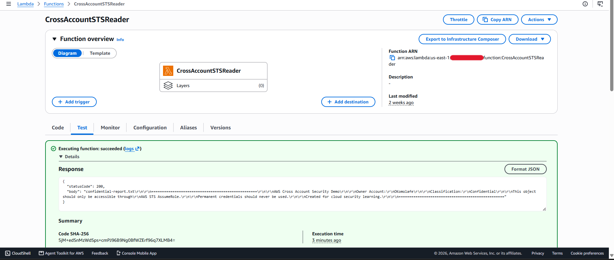
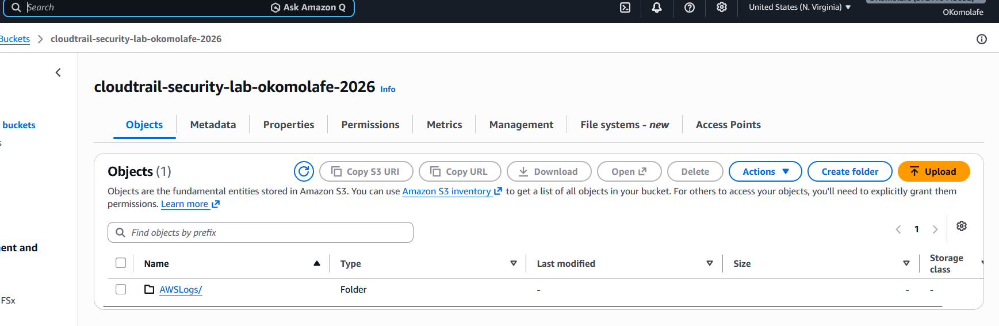

# AWS-STS-Cross-Account-Security-Monitoring
## About
This project demonstrates how to securely implement cross-account AWS resource access using AWS Security Token Service (STS), IAM roles, Amazon S3, AWS Lambda, AWS CloudTrail, and CloudWatch.

### Two AWS were created to execute this projects:
* Account A - This account hosts the AWS Lambda that uses an IAM role to  execute the function, requesting temporary credentials through STS.
* Account B - This account hosts the S3 bucket with a confidential file and can be accessed by the IAM role that Account A is allowed to assume.

After the IAM role in Account A is assumed, CloudTrail records the cross-account AssumeRole activity, while AWS EventBridge detects the activity and sends an alert through AWS SNS when the designated cross-account role is assumed.

## Objectives

### The primary objectives of this project were to:

* Understand AWS STS and temporary security credentials
* Implement cross-account IAM role assumption
* Apply least-privilege IAM permissions
* Secure access to an S3 bucket
* Use Lambda to perform cross-account operations
* Configure CloudTrail to monitor S3 and STS activity
* Create an EventBridge security detection
* Configure SNS email alerting
* Investigate and reduce unnecessary security alerts
* Understand how AWS services work together in a cloud security monitoring architecture

## AWS Services Used
### This is a list of all the AWS Services used for both Account A and B with its purpose within the project.
| AWS Service |	Purpose |
| --- | --- |
| AWS IAM |	Created and controlled cross-account roles and permissions |
| AWS STS |	Provided temporary credentials through AssumeRole |
| AWS Lambda | Initiated the cross-account access request |
| Amazon S3 |	Protected resource accessed from Account A |
| AWS CloudTrail | Recorded API activity and security events |
| Amazon EventBridge | Detected suspicious/specific STS activity |
| Amazon SNS	| Delivered security alerts through email |

## Project Structure


### Account A
#### Account A contains:
* IAM Role (Lambda Execution Role)
* Lambda function
  * The Lambda function uses AWS STS to request temporary credentials for a role located in Account B.

This image is the IAM Role "Lambda-Execution-Role" that is used by Lambda to request temporary credentials from AWS STS

### Account B
#### Account B contains:
* IAM Role (CrossAccountS3AccessRole)
* Secure S3 bucket
* CloudTrail
* EventBridge rule
* SNS topic

 


These images are the IAM Role, S3 Bucket, and the CloudTrail configuration

## What Problem Is This Project Solving?
This project presents a solution to the following question: "How can we get an AWS account access to a resource in another AWS account securely?" In a insecure work environment. Account B would allow Account A permanent access to assume it.

## Phase 1: S3 Bucket Security Configuration and Upload file
### A private S3 bucket was created in Account B to serve as the protected resource.

#### Security configurations included:

* Block Public Access enabled
* Bucket Owner Enforced Object Ownership
* Server-side encryption enabled
* Bucket-level access controlled through IAM and bucket policies
* No public access
  


#### Security Principle
* The S3 bucket was intentionally kept private.
* Access is granted through IAM rather than making the bucket publicly accessible
  
### Secured Object in S3 Bucket
* A test object was uploaded to the bucket (confidential-report.txt) for the Lambda function to retrieve.
  * confidential-report.txt in the S3 Bucket can only be accessed by Account B


## Phase 2: Cross-Account IAM Role in Account B

An IAM role called:
### CrossAccountS3AccessRole

The IAM Policy (CrossAccountS3ReadPolicy) allows the role to only perform reading access to the S3 bucket.

The Trust Relationship allows the designated Account A to assume the IAM Role.
* Trust Relationship says "I trust Account A to assume (CrossAccountS3AccessRole)"


The permissions policy was restricted to the required S3 actions.


#### This follows the principle of least privilege by granting access only to the required S3 objects.

## Phase 3: Create the Lambda Execution Role and Lambda Function in Account A

An IAM role called:
### LambdaExecutionRole 
was created to allow the Lambda function to execute and interact with AWS services.

#### The LambdaExecutionRole will have Attached Policies and Inline Policy
* Attached policies (AWSLambdaBasicExecutionRole) - Create CloudWatch log groups and write logs from Lambda
* Inline policy (AllowCrossAccountAssumeRole) - Allows Lambda to assume the CrossAccountS3AccessRole in Account B using STS AssumeRoles for temp credentials




### The Lambda Function was configured to use the Execution Role

#### The execution role is separate from the cross-account role:
* AWS Lambda is executed by the LambdaExecutionRole.
* Lambda then assumes the role of CrossAccountS3AccessRole
* CrossAccountS3AccessRole accesses confidential-report.txt in S3 Bucket

#### This separation helped demonstrate the difference between:
* A Lambda's execution permissions
* A role's trust relationship
* A role's resource permissions


## Phase 4: AWS STS Cross-Account Access

### The Lambda Function uses LambdaExecutionRole to call AWS STS. Lambda assumes CrossAccountS3AccessRole and given temporary keys from STS.

The temporary credentials are then used to access the S3 object. 

This demonstrates why STS is useful for cloud security: applications can obtain temporary credentials instead of relying on permanent access keys.

### Deploying the code to Lambda

```py
import boto3
import os

def lambda_handler(event, context):

    print("Starting cross-account S3 access")

    role_arn = os.environ["CROSS_ACCOUNT_ROLE_ARN"]
    bucket_name = os.environ["S3_BUCKET_NAME"]
    object_key = os.environ["S3_OBJECT_KEY"]

    sts = boto3.client("sts")

    print("Requesting temporary credentials from STS")a

    response = sts.assume_role(
        RoleArn=role_arn,
        RoleSessionName="CrossAccountSession"
    )
    
    print("Successfully assumed cross-account role")

    credentials = response["Credentials"]

    s3 = boto3.client(
        "s3",
        aws_access_key_id=credentials["AccessKeyId"],
        aws_secret_access_key=credentials["SecretAccessKey"],
        aws_session_token=credentials["SessionToken"]
    )

    print("Attempting to read S3 object")

    response = s3.get_object(
        Bucket=bucket_name,
        Key=object_key
    )

    content = response["Body"].read().decode("utf-8")
    
    print("Successfully retrieved S3 object")

    print(content)

    return {
        "statusCode": 200,
        "body": content
    }
```
Test event to print the content of confidential-report.txt


#### This is the output when the code fails. The IAM role attempts to access another file in the the S3 Bucket called "public-text.txt", but the role is denied access.



#### This is the output when the code succeeds. The IAM role successfully accesses confidential-report.txt. Establishing least-privilege on the IAM role to only allowed read-access to confidential-report.txt

## Phase 5: CloudWatch & CloudTrail Auditing

### AWS CloudTrail was configured to record relevant AWS activity.
#### S3 data events were enabled to monitor object-level operations such as:
* GetObject
* PutObject
* DeleteObject

### Check CloudWatch Logs to see the log stream of the tested event
#### Provide visibility into Lambda execution and used for debugging


CloudTrail records API calls - we are looking at:
* sts: AssumeRole
* s3: GetObject

CloudTrail can tell you who, what, where, what role, and what happened in CloudTrail Logs

### Create a S3 Bucket to store CloudTrail Trails



### STS activity was also monitored through CloudTrail management events.
This allowed the project to observe AssumeRole activity generated by the cross-account Lambda.


## Phase 7: Security Hardening & Validation

Change Account A role's (LambdaExecutionRole) resources from "*" to "CrossAccountS3AccessRole"["Resource": "arn:aws:iam::ACCOUNT_B_ID:role/CrossAccountS3AccessRole"]


"*" will allow Lambda to assume any role that trusts it - goes against least privilege.
Give CrossAccountS3AccessRole only access to "confidential-report.txt.txt" file and not the entire s3 Bucket
Add environmental variables unto Lambda code instead of hardcoding configurations like account ID's and file names
Added "public-test.txt" in "secure-cross-account-demo-okomolafe" s3 bucket
Test lambda by misconfiguring environment variable to access "public-test.txt" instead of "confidential-report.txt.txt"
Access was denied since CrossAccountS3AccessRole only has access to ""confidential-report.txt.txt"


```json
{
  "source": [
    "aws.sts"
  ],
  "detail-type": [
    "AWS API Call via CloudTrail"
  ],
  "detail": {
    "eventSource": [
        "sts.amazonaws.com"
    ],
    "eventName": [
        "AssumeRole"
    ],
    "requestParameters": {
      "roleArn": [
        "arn:aws:iam::372110443032:role/CrossAccountS3AccessRole"
      ]   
    }
  }
}
```
