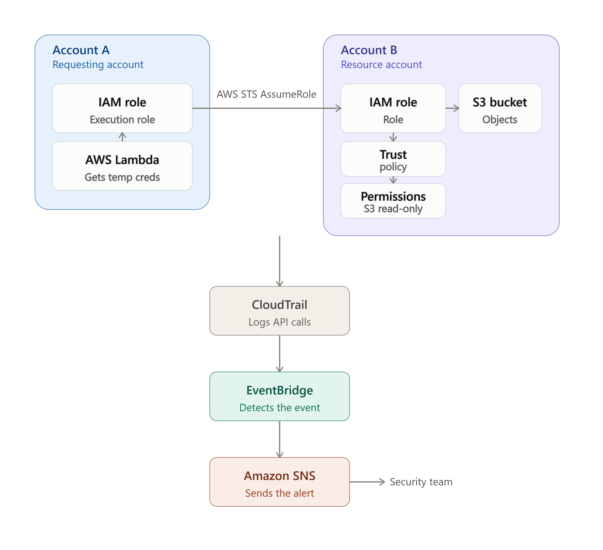

# AWS-STS-Cross-Account-Security-Monitoring
## About
This project demonstrates how to securely implement cross-account AWS resource access using AWS Security Token Service (STS), IAM roles, Amazon S3, AWS Lambda, AWS CloudTrail, and CloudWatch.

### Two AWS were created to execute this projects:
* Account A - This account hosts the AWS Lambda that uses an IAM role to  execute the function, requesting temporary credentials through STS.
* Account B - This account hosts the S3 bucket with a confidential file and can be accessed by the IAM role that Account A is allowed to assume.

After the IAM role in Account A is assumed, CloudTrail records the cross-account AssumeRole activity, while AWS EventBridge detects the activity and sends an alert through AWS SNS when the designated cross-account role is assumed.

## Objectives

### The primary objectives of this project were to:

* Understand AWS STS and temporary security credentials
* Implement cross-account IAM role assumption
* Apply least-privilege IAM permissions
* Secure access to an S3 bucket
* Use Lambda to perform cross-account operations
* Configure CloudTrail to monitor S3 and STS activity
* Create an EventBridge security detection
* Configure SNS email alerting
* Investigate and reduce unnecessary security alerts
* Understand how AWS services work together in a cloud security monitoring architecture

## AWS Services Used
### This is a list of all the AWS Services used for both Account A and B with its purpose within the project.
| AWS Service |	Purpose |
| --- | --- |
| AWS IAM |	Created and controlled cross-account roles and permissions |
| AWS STS |	Provided temporary credentials through AssumeRole |
| AWS Lambda | Initiated the cross-account access request |
| Amazon S3 |	Protected resource accessed from Account A |
| AWS CloudTrail | Recorded API activity and security events |
| Amazon EventBridge | Detected suspicious/specific STS activity |
| Amazon SNS	| Delivered security alerts through email |

## Project Structure

### Account A
#### Account A contains:
* IAM Role (Lambda Execution Role)
* Lambda function
  * The Lambda function uses AWS STS to request temporary credentials for a role located in Account B.

This image is the IAM Role "Lambda-Execution-Role" that is used by Lambda to request temporary credentials from AWS STS

### Account B
#### Account B contains:
* IAM Role (CrossAccountS3AccessRole)
* Secure S3 bucket
* CloudTrail
* EventBridge rule
* SNS topic

 

These images are the IAM Role, S3 Bucket, and the CloudTrail configuration

## What Problem Is This Project Solving?
This project presents a solution to the following question: "How can we get an AWS account access to a resource in another AWS account securely?" In a insecure work environment. Account B would allow Account A permanent access to assume it.

## Phase 1: S3 Bucket Security Configuration and Upload file
### A private S3 bucket was created in Account B to serve as the protected resource.

#### Security configurations included:

* Block Public Access enabled
* Bucket Owner Enforced Object Ownership
* Server-side encryption enabled
* Bucket-level access controlled through IAM and bucket policies
* No public access
  

#### Security Principle
* The S3 bucket was intentionally kept private.
* Access is granted through IAM rather than making the bucket publicly accessible
  
### Secured Object in S3 Bucket
* A test object was uploaded to the bucket (confidential-report.txt) for the Lambda function to retrieve.
  * confidential-report.txt in the S3 Bucket can only be accessed by Account B

## Phase 2: Cross-Account IAM Role in Account B

An IAM role called:
### CrossAccountS3AccessRole

The IAM Policy (CrossAccountS3ReadPolicy) allows the role to only perform reading access to the S3 bucket.

The Trust Relationship allows the designated Account A to assume the IAM Role.
* Trust Relationship says "I trust Account A to assume (CrossAccountS3AccessRole)"

The permissions policy was restricted to the required S3 actions.

